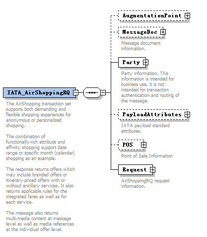

# **IATA_AirShoppingRQ**

**IATA_AirShoppingRQ**

根节点，包含以下节点：

1.AugmentationPoint：扩展节点

2.MessageDoc：消息文本信息

3.Party：身份信息

4.PayloadAttributes：消息标记信息

5.POS：销售方信息

6.Request：请求信息

1. **AugmentationPoint**

   扩展节点

   

   该节点为NDC预留的扩展节点，航空公司可以根据需求，在该节点下自行扩展各自需要的额外节点。

   

2. **MessageDoc** (MessageDocType)

   Message document information.

   消息文本信息

   

   该节点用于标识报文消息使用的协议。

   2.1. **Name**

   Implementation Name. Example: ThisAirline Gateway
   
   实现名称。自定义的当前消息的名称。
   
   2.2. **RefVersionNumber**
   
   Framework Version. Example: SOAP 2015.1
   
   使用的版本号。框架版本号。
   
   
   
3. **Party** (PartyType)

   Party information.  This information is intended for business use, it is not intended for transaction authentication and routing of the message.

   身份信息

   

   该节点用于标识请求方和接收方身份信息，只用于业务使用，标识身份，不用于身份验证。

   3.1. **Participant** (ParticipanType)

   Message Participant(s).
   
   消息参与者
   
   
   
   
   
   消息参与者指消息除最下游发送者和最上游接收者之间的中间参与者。
   
   这部分内容应由中间环节各参与者添加，当第一消息的第一接收方将接收到的消息转换为第二消息发送出去后，那么第一接收方应当在Participant中标明自己的身份信息，并将第二消息的接收方修改为第二消息的实际接收方，第二消息的发送方与第一消息的发送方保持一致，依次类推。
   
   当最上游将消息返回时，消息发送方、消息接收方、中间参与者应与收到的第一消息保持一致，后续接收到消息的中间参与者在返回消息时，消息发送方、消息接收方、中间参与者的信息应与收到消息返回中的保持一致。

3.1.1. **Aggregator**(AggregatorType)

An entity who distributes a Seller's shopping request to multiple Airlines and aggregates subsequent responses.

聚合商信息

字节点ContactInfo类型为ContactInfoType，其中定义的联系信息，以下字段并不适合聚合商使用，包括：IndividualRefID、PaxSegmentRefID、RelationshipToPax。

3.1.1.1. **AggregatorID**

聚合商编号

3.1.1.2. **ContactInfo**(ContactInfoType)

The electronic or geographic address which a party has provided as the contact channel. For example, contact email, contact postal address, contact phone number.

作为联系渠道的电子地址或者地理地址。

3.1.1.2.1. **ContactInfoID**

Uniquely Identifies a set of Contact Information, within the context of one message.

在一次消息中唯一标识本联系信息的编号

3.1.1.2.2. **ContactPurposeText**

to identify the contact purpose (PADIS code list 3299)

联系地址的用途（参考PADIS 3299）

3.1.1.2.3. **ContactRefusedInd**

When TRUE, Contact Information was refused to be provided.

拒绝提供联系方式时，填写“TRUE”

3.1.1.2.4. **EmailAddress**

The email address which should be used for contact purposes.

电子邮件地址

3.1.1.2.5. **Individual**(IndividualType)

A single human being as distinct from a group, class, or family.

一个区别于团体、阶级、家庭的独立个人

// TODO

用于填写当前联系信息的实际接收个人信息。

3.1.1.2.6. **IndividualRefID**

Reference to Individual instance(s)

个人的引用编号。

3.1.1.2.7. **OtherAddress**(OtherAddressType)

Other Contact Method information. E.g. web site URL, social media handle.

其他的联系方式信息，例如：网站网址，社交媒体

// TODO

3.1.1.2.8. **PaxSegmentRefID**

Uniquely identifies a Passenger Segment within the context of one message.

在一次消息中标示唯一的行程航段

3.1.1.2.9. **Phone**(PhoneType)

A telephone number is a sequence of digits assigned to a fixed-line telephone subscriber station connected to a telephone line or to a wireless electronic telephony device, such as a radio telephone or a mobile telephone, or to other devices for data transmission via the public switched telephone network (PSTN) or other private networks.

电话号码

// TODO

3.1.1.2.10. **PostalAddress**(PostalAddressType)

Natural or physical address used for postal service. May be a building address, airport address, etc.

邮政地址

3.1.1.2.11. **RelationshipToPax**

Relationship to the passenger e.g. used for when this individual is an emergency contact

与乘客的关系

3.1.1.3. **Name**

Aggregator Name

聚合商名称

3.2. **Recipient**

Message recipient information.

消息接收者信息

// TODO

3.3. **Sender**

Message sender information.

消息发送者信息

// TODO